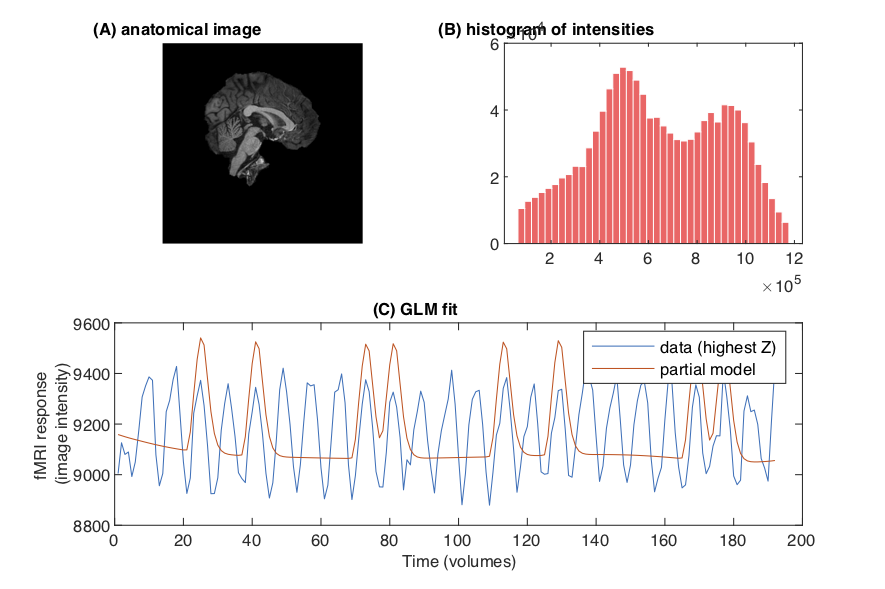

## 2019/20 details on the assignment

The following will hopefully clarify some of the questions you might have about the assignment. There are also some suggestions for ideas you can explore, that are specific to this year's dataset.

### Summary

Aim: demonstrate ability to perform GLM style analysis with a tool like `fsl` and write up the results in a journal-style essay. To produce figures, plots to show results and support your conclusions, you are allowed to rely on images and plots produced by `fsl` and your own replotted versions using `matlab` (+ any other tools you find useful).  

- 250w abstract
- plus a main document (max 1500w)
- references / citations as for standard written work (these don't add to the wordcount)
- max. 5 figures illustrating details of the experimental setup, analysis methodology and results (figures can have sub-panels or subplots)

### FAQ

1. **Wordcount?** Please stick to the numbers. Many journals enforce hard limits at the submission stage (online form), so IRL you won't even be able to submit a piece if it doesn't meet the criteria.

2. **Wordcount/figure legends + references**. These don't add to the wordcount.

3. Submission is via moodle / turnitin so please also pay particular attention to how you reference and cite material.

4. Please submit one document (`pdf`, Word Doc, Open office, ...) and put figures inline as you would with any other essay / lab report.

5. **Which dataset(s) do I need to analyze?** You are welcome to analyze any of the datasets we collected, but I suggest you stick to the first fMRI data set from one or more participants (A, B, and/or C). The details of how the data were acquired and the stimulus code are available on the github page. In brief, the experiment was a `scene_localiser()` in which images of 3 different categories (faces, objects, and scenes) atlernated with a gray background screen. Participants performed a task (press a button if you see a grayscale [as opposed to a full colour] version of an image).

6. "What do you mean by sub-panels, sub-plots?" - see the [matlab script example `example_figure_making.m`](example_figure_making.m). There is still some tweaking to do, but hopefully a good starting point for everyone.

Inspect [the PDF file](figureWithReasonableSize.pdf) and think about whether you want to do some final touches with a tool like https://inkscape.org/en/